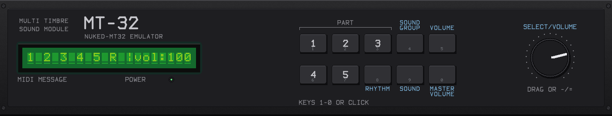
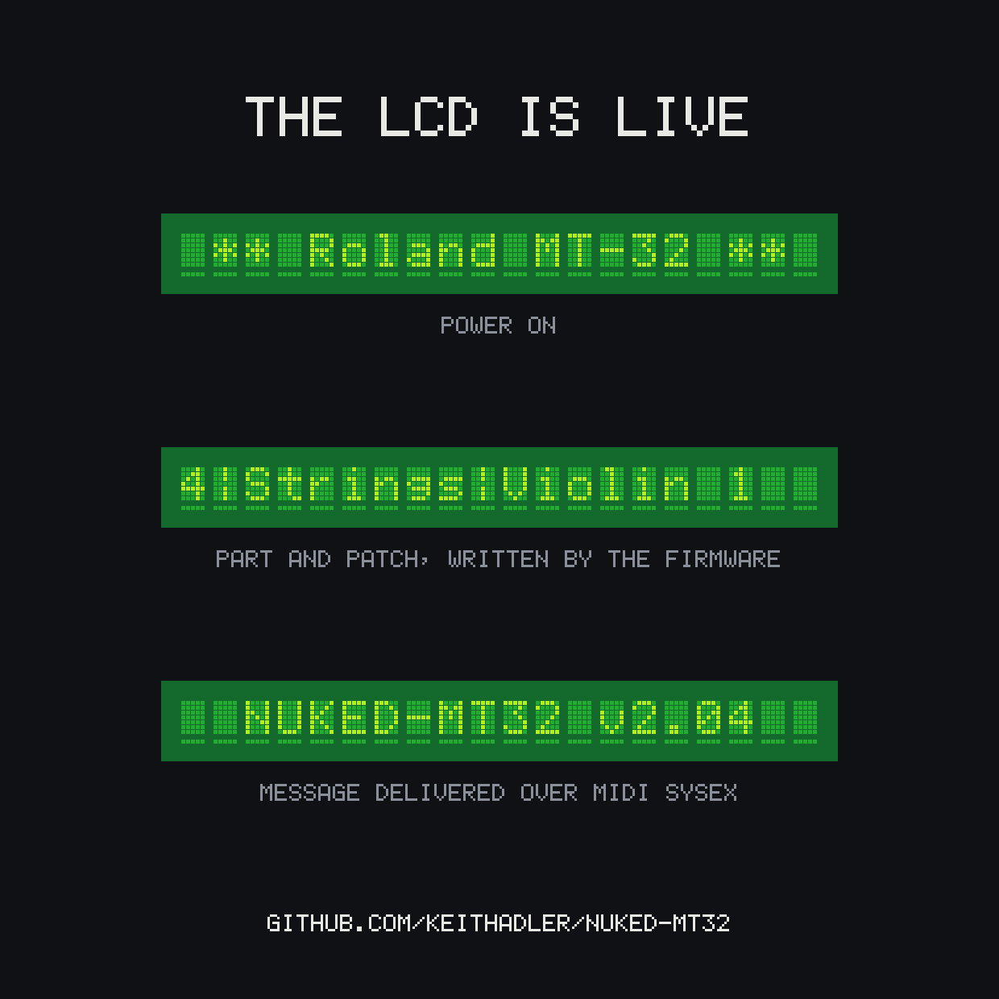

<div align="center">



# Nuked-MT32

**A Roland MT-32 emulator built from the silicon up — now on macOS, Linux and Windows.**

[](https://github.com/keithadler/Nuked-MT32/actions/workflows/build.yml)
[](LICENSE)


</div>

---

> **What is and isn't accurate:** this fork did **not** fix the synth-engine
> bugs upstream flagged. [`FINDINGS.md`](FINDINGS.md) documents a differential
> test against Munt — pitch is exact, every spectral peak matches to the FFT
> bin, log-spectrum correlation 0.93 — along with the DC bias localized to the
> `w1` path, and the fixes that were tried and failed, so the next person
> doesn't repeat them. Reverb is a behavioural model, not emulation. Nothing
> here has been compared against real hardware.

The MT-32 was the sound of PC gaming from 1987 — Sierra, LucasArts, the whole
catalogue. This emulates the machine itself: the firmware runs on an emulated
MCS-96 CPU, and the LA32 synthesis chip is modelled from a photograph of the
actual die.

[**@nukeykt**](https://github.com/nukeykt) wrote it, got it working, and
[released it unfinished](https://github.com/nukeykt/Nuked-MT32) in September
2026 with the repo archived. This continues that work. The emulation is his.

## What this fork adds

| | |
|---|---|
| **It builds anywhere** | CMake for macOS, Linux and Windows, CI green on all three. Upstream was a Visual Studio solution with a vendored SDL2 and could not build elsewhere at all. |
| **A front panel** | Clickable buttons, draggable volume knob, the real LCD. |
| **Reverb** | Absent upstream. Optional here, and clearly labelled. |
| **Headless rendering** | `mt32-render` turns a MIDI file into a WAV with no audio device. Deterministic. |
| **ROM identification** | `mt32-romid` fingerprints ROM images by SHA-1 and tells you what you have. |
| **Tests** | A self test and a 16-file MIDI stress battery. |
| **Old MT-32 support** | v1.04 through v1.07 and BlueRidge, alongside v2.x. Upstream was v2.x only. |
| **Bug fixes** | Including undefined behaviour on teardown. See [below](#bugs-fixed-in-the-original). |

## The display is not a mockup

<div align="center"></div>

Every character there was written by the MT-32's own firmware. Hold `RHYTHM`
and turn the knob and the machine prints `Rhythm Part |vol> 74`, because the
firmware is responding to the front panel — not because anything was drawn on
top of it.

## Quick start

Prebuilt binaries for macOS, Linux and Windows are attached to each
[release](https://github.com/keithadler/Nuked-MT32/releases). No ROMs included —
bring your own. To build from source:

```sh
brew install cmake sdl2                 # macOS
# apt install cmake libsdl2-dev libasound2-dev libgl1-mesa-dev   # Debian/Ubuntu

cmake -B build -DCMAKE_BUILD_TYPE=Release
cmake --build build -j

./build/nuked-mt32 -c MT32_CONTROL.ROM -p MT32_PCM.ROM
```

Click the panel buttons or press `1`-`0`. Drag the volume knob or use `-`/`=`.
`Esc` quits.

MIDI input is automatic. On macOS the emulator publishes a virtual CoreMIDI
destination called **Nuked-MT32** — select it as the output in any DAW — and
also connects to every physical MIDI source it finds. Linux gets an ALSA
sequencer port of the same name; Windows uses winmm.

## ROMs

**Not included, and never will be.** They are copyrighted Roland firmware.
Supply your own, dumped from hardware you own. `.gitignore` is set up to keep
them out of the repository.

**Both the old and new MT-32 are supported**, detected automatically from the
control ROM's size:

| Image | Size | Notes |
|---|---|---|
| Control (v1.xx) | 65536 (64 KiB) | "old" MT-32 — v1.04 / v1.05 / v1.06 / v1.07 / BlueRidge |
| Control (v2.xx) | 131072 (128 KiB) | "new" MT-32 — v2.03 / v2.04 / v2.06 / v2.07 |
| PCM | 524288 (512 KiB) | Shared by both |

If you are here for the games, you want **v1.07**. The Sierra and LucasArts
catalogue was voiced on the old MT-32, and v2.x changed the voicing — the two
measure only 0.82 log-spectrum correlation on identical material, so the
difference is audible, not academic.

All six firmware revisions above boot, display and play. The 16-file test
battery passes on both machines.

Not sure what you have?

```sh
./build/mt32-romid *.rom *.ROM
```

It knows full images and the 32 KiB / 256 KiB halves that MAME-style dumps come
in. It will also catch a GitHub page saved as `MT32_CONTROL.ROM`, which is a
mistake that looks completely convincing in a file listing.

## Rendering MIDI offline

```sh
./build/mt32-render -c CONTROL.ROM -p PCM.ROM -m song.mid -o out.wav
```

No audio device needed, runs faster than real time, and the output is
deterministic — so synth changes are diffable.

> **MIDI channel gotcha.** The MT-32 puts parts 1-8 on MIDI channels **2-9**
> and rhythm on **10**. Channel 1 is unassigned, so notes sent there are
> correctly ignored and produce silence. This is the first thing to check if
> you hear nothing.

## Reverb

The MT-32's reverb is a **separate chip that has never been decapped**, so
there is nothing for a silicon-accurate implementation to be accurate to.
Upstream has no reverb at all.

This fork uses [Munt](https://github.com/munt/munt)'s behavioural Boss reverb
model as a stand-in. It is **on by default**, because a dry MT-32 does not
sound like an MT-32 — but it is an approximation, not emulation, and you can
switch it off:

```sh
./build/nuked-mt32  -c CONTROL.ROM -p PCM.ROM --reverb=off    # raw digital output
./build/mt32-render -c CONTROL.ROM -p PCM.ROM -m song.mid --reverb=off
```

Mode, time and level follow the song: the MIDI stream is watched for writes to
the MT-32 system area, so a file that asks for a hall gets a hall. Pin them
with `--reverb-mode`, `--reverb-time` and `--reverb-level` to override.

See [`munt/README.md`](munt/README.md) for the vendoring and licensing.

## Tests

```sh
./build/mt32-selftest CONTROL.ROM PCM.ROM

python3 tests/make_midis.py tests/midi
python3 tests/run_battery.py CONTROL.ROM PCM.ROM tests/midi ./build/mt32-render
```

The self test boots the machine and asserts the splash, the idle display, a
display-SysEx round trip (which exercises the CPU, the emulated UART, SysEx
parsing and the firmware's own checksum validation), that unassigned channel 1
stays silent, and that channels 2 and 10 produce audio.

The battery renders 16 MIDI files covering all 128 timbres, the full rhythm
map, 40-voice polyphony past the 32-partial limit, all eight parts at once,
heavy and long SysEx, a reset mid-note, controllers, note and velocity
extremes, 400 very short notes and rapid program changes — then checks for
crashes, hangs, stuck notes, unexpected silence, clipping and
non-determinism. Every file is rendered twice and the audio hashed.

Two cases assert *period-correct* behaviour: channel 1 must stay silent, and
CC120 All Sound Off must be **ignored** — it entered the MIDI spec with
General MIDI around 1990, three years after this machine shipped, and is
absent from Roland's implementation chart.

## Bugs fixed in the original

- **`mame/emu.h` included `"..\mt32.h"` with a backslash.** No non-Windows
  compiler accepts it. This one line was the entire barrier — fix it and the
  whole emulation core compiles clean under clang and gcc untouched.
- **Undefined behaviour on teardown.** `mcs96_device` has virtual functions but
  no virtual destructor, while `mt32_t` holds the CPU as an `i8x9x_device*`,
  constructs a `p8098_device` and calls `delete`. The derived destructor never
  ran.
- **`glTexParameteri(GL_TEXTURE_2D, GL_TEXTURE_2D, GL_CLAMP)`** — the second
  argument is the parameter-name slot, so that should be `GL_TEXTURE_WRAP_T`.
- **Constructor initialiser order** didn't match declaration order.
- **Any ROM problem did `return 0` from `main()`** and exited silently, with no
  message and a success exit code.
- Plus smaller ones. The build is clean under `-Wall -Wextra`.

## Known limitations

Stated plainly, because they matter:

- **Reverb is an approximation**, not emulation (see above).
- **The synth engine has known bugs** that upstream could not track down and
  that this fork has *not* fixed. [`FINDINGS.md`](FINDINGS.md) documents a
  differential test against Munt: pitch is exact, every spectral peak matches
  to the FFT bin, and log-spectrum correlation is 0.93 — but there is a
  patch-dependent DC offset, a level difference and a darker spectrum. The
  dead ends and the fixes that *didn't* work are written down too, so the next
  person doesn't repeat them.
- **Nothing here has been compared against real hardware.**

## Credits

- **[nukeykt](https://github.com/nukeykt)** — the emulator.
- **[John McMaster](https://siliconprawn.org)** — the LA32 die decap everything
  rests on.
- **Olivier Galibert / MAME** — the MCS-96 CPU core.
- **[Munt](https://github.com/munt/munt)** (Dean Beeler, Jerome Fisher,
  Sergey V. Mikayev) — the reverb model, and the reference used to characterise
  the synth-engine differences.

## License

GPL-2.0, as upstream. The MAME-derived MCS-96 core under `mame/` carries its
own license. The vendored reverb model under `munt/` is LGPL-2.1-or-later,
which is compatible — see [`munt/README.md`](munt/README.md).
